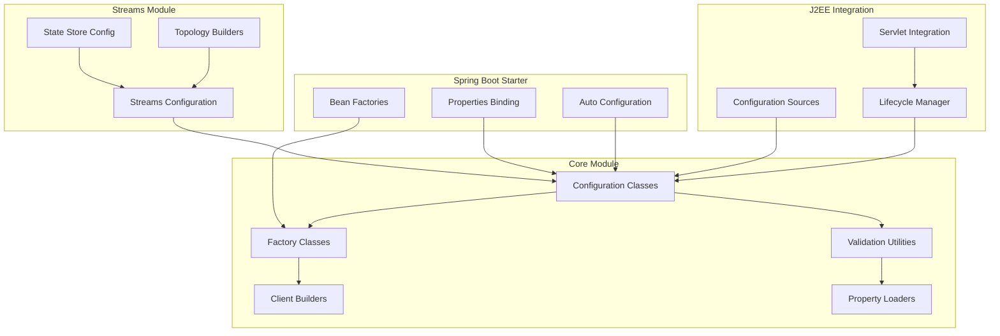

# Design Document

## Overview

This design outlines comprehensive improvements to the Kafka Auto Configuration Library across all four modules: kafka-core, j2ee-kafka-integration, spring-boot-starter-kafka-auto-config, and kafka-streams-auto-config. The improvements focus on code quality, maintainability, testing, documentation, and architectural consistency while maintaining backward compatibility.

## Architecture

### Current Architecture Analysis

The project follows a multi-module Maven structure with clear separation of concerns:
- **kafka-core**: Framework-agnostic foundation
- **j2ee-kafka-integration**: J2EE/Jakarta EE integration
- **spring-boot-starter-kafka-auto-config**: Spring Boot integration
- **kafka-streams-auto-config**: Kafka Streams specific functionality

### Improved Architecture Design



## Components and Interfaces

### 1. Core Module Improvements

#### Enhanced Configuration Validation
```java
public interface ConfigurationValidator {
    ValidationResult validate(Map<String, Object> properties);
    void validateRequired(Map<String, Object> properties, String... requiredKeys);
    void validateRange(Map<String, Object> properties, String key, Number min, Number max);
    void validateAllowedValues(Map<String, Object> properties, String key, String... allowedValues);
}

public class ValidationResult {
    private final boolean valid;
    private final List<ValidationError> errors;
    private final List<ValidationWarning> warnings;
}
```

#### Improved Factory Pattern
```java
public interface KafkaClientFactory<T> {
    T create(Map<String, Object> properties);
    T create(Properties properties);
    void validateConfiguration(Map<String, Object> properties);
}

public abstract class AbstractKafkaClientFactory<T> implements KafkaClientFactory<T> {
    protected final ConfigurationValidator validator;
    protected final Map<String, Object> defaultProperties;
}
```

#### Enhanced Property Management
```java
public interface PropertySource {
    Map<String, Object> getProperties();
    Optional<Object> getProperty(String key);
    boolean containsProperty(String key);
}

public class CompositePropertySource implements PropertySource {
    private final List<PropertySource> sources;
    // Combines multiple property sources with precedence
}
```

### 2. J2EE Integration Improvements

#### Enhanced Lifecycle Management
```java
public interface LifecycleManager {
    void register(AutoCloseable resource);
    void unregister(AutoCloseable resource);
    void shutdown();
    void shutdown(Duration timeout);
}

public class KafkaLifecycleManager implements LifecycleManager, ServletContextListener {
    private final ExecutorService shutdownExecutor;
    private final Duration defaultShutdownTimeout;
    // Thread-safe resource management with proper error handling
}
```

#### Configuration Source Abstraction
```java
public interface ConfigurationSource extends PropertySource {
    String getSourceName();
    boolean isAvailable();
    void refresh();
}

public class ChainedConfigurationSource implements ConfigurationSource {
    // Chains multiple configuration sources with fallback logic
}
```

### 3. Spring Boot Starter Improvements

#### Enhanced Auto-Configuration
```java
@Configuration
@ConditionalOnClass(KafkaTemplate.class)
@EnableConfigurationProperties(KafkaProperties.class)
public class KafkaAutoConfiguration {
    
    @Bean
    @ConditionalOnMissingBean
    public KafkaProducerFactory<?, ?> kafkaProducerFactory(KafkaProperties properties) {
        // Enhanced factory with validation and monitoring
    }
    
    @Bean
    @ConditionalOnMissingBean
    public KafkaConsumerFactory<?, ?> kafkaConsumerFactory(KafkaProperties properties) {
        // Enhanced factory with validation and monitoring
    }
}
```

#### Improved Properties Binding
```java
@ConfigurationProperties(prefix = "spring.kafka")
public class KafkaProperties {
    
    @NestedConfigurationProperty
    private Producer producer = new Producer();
    
    @NestedConfigurationProperty
    private Consumer consumer = new Consumer();
    
    @NestedConfigurationProperty
    private Admin admin = new Admin();
    
    // Enhanced validation and documentation
}
```

### 4. Testing Framework Improvements

#### Test Utilities
```java
public class KafkaTestUtils {
    public static EmbeddedKafka createEmbeddedKafka();
    public static Map<String, Object> createTestProducerProperties();
    public static Map<String, Object> createTestConsumerProperties();
    public static void waitForCondition(Supplier<Boolean> condition, Duration timeout);
}

@TestConfiguration
public class KafkaTestConfiguration {
    // Provides test-specific beans and configurations
}
```

#### Integration Test Support
```java
@ExtendWith(KafkaTestExtension.class)
public class KafkaIntegrationTest {
    @KafkaTest
    private EmbeddedKafka kafka;
    
    // Simplified integration testing
}
```

## Data Models

### Configuration Models
```java
public class KafkaClientConfiguration {
    private final Map<String, Object> properties;
    private final ValidationResult validationResult;
    private final ConfigurationMetadata metadata;
    
    // Immutable configuration with validation results
}

public class ConfigurationMetadata {
    private final String source;
    private final Instant createdAt;
    private final Map<String, PropertyMetadata> propertyMetadata;
}
```

### Error Models
```java
public class ValidationError {
    private final String propertyKey;
    private final Object invalidValue;
    private final String message;
    private final ErrorSeverity severity;
}

public class ConfigurationException extends RuntimeException {
    private final List<ValidationError> errors;
    private final String configurationSource;
}
```

## Error Handling

### Centralized Error Handling Strategy
1. **Validation Errors**: Collected and reported together with suggested fixes
2. **Runtime Errors**: Wrapped with context information and recovery suggestions
3. **Resource Cleanup**: Guaranteed cleanup even in error scenarios
4. **Logging**: Structured logging with correlation IDs for troubleshooting

### Error Recovery Patterns
```java
public class ErrorRecoveryManager {
    public <T> T executeWithRetry(Supplier<T> operation, RetryPolicy policy);
    public void handleGracefulShutdown(List<AutoCloseable> resources, Duration timeout);
    public ValidationResult validateWithSuggestions(Map<String, Object> properties);
}
```

## Testing Strategy

### Unit Testing Improvements
1. **Coverage Target**: Minimum 85% code coverage per module
2. **Test Structure**: Consistent AAA (Arrange-Act-Assert) pattern
3. **Mock Strategy**: Minimal mocking, prefer test doubles for external dependencies
4. **Parameterized Tests**: Use JUnit 5 parameterized tests for configuration variations

### Integration Testing Framework
1. **Embedded Kafka**: Consistent embedded Kafka setup across modules
2. **Test Containers**: Optional TestContainers integration for realistic testing
3. **Configuration Testing**: Dedicated tests for configuration validation and loading
4. **Lifecycle Testing**: Tests for proper resource management and cleanup

### Performance Testing
1. **Benchmark Tests**: JMH-based performance tests for critical paths
2. **Memory Testing**: Tests for memory leaks and resource cleanup
3. **Concurrency Testing**: Multi-threaded tests for thread safety

## Code Quality Standards

### Coding Standards
1. **Formatting**: Consistent code formatting with Maven Checkstyle plugin
2. **Documentation**: Comprehensive JavaDoc for all public APIs
3. **Naming**: Clear, descriptive names following Java conventions
4. **Method Size**: Maximum 20 lines per method (with exceptions for builders)
5. **Class Responsibility**: Single Responsibility Principle enforcement

### Static Analysis
1. **SpotBugs**: Automated bug detection
2. **PMD**: Code quality analysis
3. **Checkstyle**: Code style enforcement
4. **SonarQube**: Comprehensive code quality metrics

### Dependency Management
1. **Version Consistency**: Centralized version management in parent POM
2. **Dependency Analysis**: Regular dependency vulnerability scanning
3. **Minimal Dependencies**: Avoid unnecessary transitive dependencies
4. **API Compatibility**: Maintain backward compatibility for public APIs

## Documentation Strategy

### API Documentation
1. **JavaDoc**: Complete JavaDoc for all public classes and methods
2. **Examples**: Code examples in JavaDoc comments
3. **Parameter Documentation**: Clear parameter descriptions and constraints
4. **Return Value Documentation**: Detailed return value descriptions

### User Documentation
1. **Module READMEs**: Comprehensive README for each module
2. **Getting Started Guides**: Step-by-step setup instructions
3. **Configuration Reference**: Complete configuration property documentation
4. **Best Practices**: Documented best practices and common patterns

### Developer Documentation
1. **Architecture Documentation**: High-level architecture diagrams and explanations
2. **Contributing Guidelines**: Clear guidelines for contributors
3. **Build Instructions**: Detailed build and development setup instructions
4. **Release Process**: Documented release and versioning process

## Migration Strategy

### Backward Compatibility
1. **API Preservation**: Maintain existing public APIs
2. **Deprecation Strategy**: Gradual deprecation with clear migration paths
3. **Configuration Compatibility**: Support existing configuration formats
4. **Behavioral Compatibility**: Preserve existing behavior unless explicitly changed

### Implementation Phases
1. **Phase 1**: Core module improvements and testing framework
2. **Phase 2**: J2EE integration enhancements
3. **Phase 3**: Spring Boot starter improvements
4. **Phase 4**: Kafka Streams module enhancements
5. **Phase 5**: Documentation and final integration testing

## Monitoring and Observability

### Metrics Integration
```java
public interface KafkaMetrics {
    void recordProducerMetric(String name, double value, Map<String, String> tags);
    void recordConsumerMetric(String name, double value, Map<String, String> tags);
    void recordConfigurationEvent(String event, Map<String, String> properties);
}
```

### Health Checks
```java
public interface KafkaHealthIndicator {
    HealthStatus checkProducerHealth();
    HealthStatus checkConsumerHealth();
    HealthStatus checkAdminClientHealth();
}
```

This design provides a comprehensive roadmap for improving all aspects of the Kafka Auto Configuration Library while maintaining its modular architecture and ensuring backward compatibility.